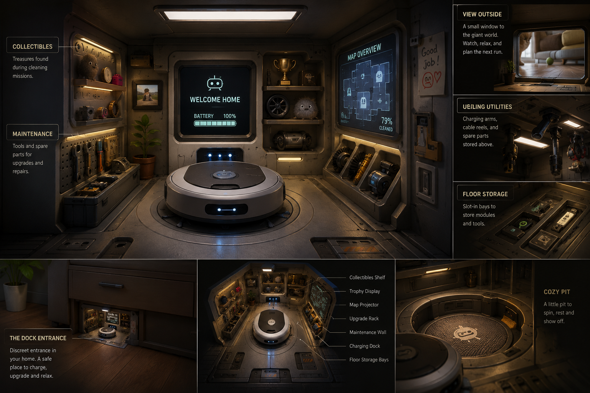

what happens when the player launches the game

1. splash screen (why do we need it before loading the title screen?)
2. title screen where we can
     2.1. load previous save
     2.2. start new game
     2.3. settings
     2.4. exit
     2.5. credits
3. load previous save or start new game - get data, start game with loaded data. maybe load screen like every large game has
4. settings: general, display, audio, gameplay, key bindings etc. whatever else is needed
5. when the game is loaded from the save, we go to the state of game which we saved.
6. when we start new game 
7. cutscene of a girl buying a bot from underground store. may be with cameras or images sequence, with some text below. or images now but 3d cut will replace it once we hire an animator
8. here we can chose the appearance of the robot - character creation. and name. at first interation we can only choose robot's color, but when 3d artists create more models, we will be able to switch parts of it, when they are designed
9. girl unpacks the bot at home - still cutscene
10. bot wakes up on it's doc station. doc station looks like 
11. doc station is empty at the beginning, because nothing is designed yet, but modules can be added to dock station. 
12. dock station is a hole in a wall with rollet. when we come near it, there is a laser that security checks that this is the correct bot. like scanner of eye. then rollet opens, and we can go inside. then bot automatically moves to the charging station and begins charging. the mode switches to where we can click with mouse on different ui interfaces and modules that will be designed later. 
13. after waking up we get some information like in cyberpunk beginning, like the bot's software is not right, and as if there is a virus, or something like that. and that the bot gains consciousness. 
14. the whole story will be written later. 
15. with some animation and visual effects we gain our first main quest: learn what happened.
16. and a subquest: go outside
17. here we get a tutorial where we learn how to move, how to interact with doors
18. we open the doors and see the room. and we get a minimap in bottom right corner that is completely in fog of war now. it will open when we move. when the layout of the learned room is changed, we react how the standard robot reacts when encounters new objects: the map gets fog of war again in the zone that was changed.
19. we see the patches of dirt or the dusty floor. we get an animation that the software inside us is confused because it is designed to clean, and we get this urge, but we dont understand why
20. we get 'go outside quest' completed, and to our main quest we get some information like in baldurs gate3 that we got unexplainable urge to clean
21. we get a subquest to clean the room
22. when we go, the floor behind us becomes clean. animation plays to show us the clean path behind us
23. then we get something like a dirt patch, and we have to interact with it like with doors to clean it. animation of very quick sucking plays with vfx. it was tested in the first prototype and this immediate action is very satisfying. 
24. we get a 'ding' + 1 dust patch collected ui to the right of us
25. tutorial how to use the interface appears
26. we see 1 patch of dust in the inventory. 
27. we close the inventory and start cleaning the room. 
28. after some time cleaning we get a ding that our dust collector is full and we get a quest to return to the base
29. we dont leave the clean marks anymore and can't collect dirt patches.
30. we get to the base, bot automatically begins to charge. we get the information that battery is like 70% and that is important to keep track of the battery. the indicator of our battery appears on our UI and will stay there from now on
31. we get a prompt to empty the dust collector and there has to be designed a bin in the room where goes dust, then after some accumulation it can be compacted to dust patch. on the fist offload it goes to maybe 3 percent to the dust patch. 
32. we get a 'ding' that we are refreshed and we go outside again to continue the quest

here the detailed vision finished, and more quests and storyline has to be written