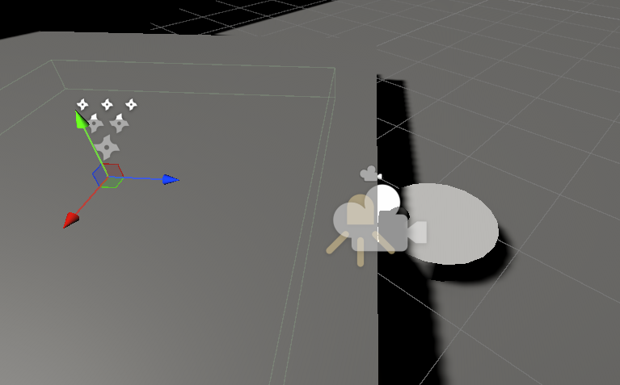
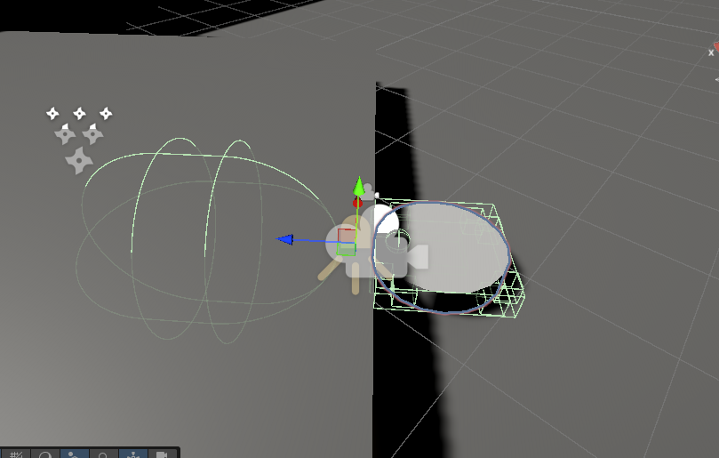

Step 1 - list nouns:

room  - the place where everything is happening. not sure if it actually changes. but maybe can be asked to go to this room. or room doesnt matter, only the location special marker
the robot - walks, sweeps, fights, can change appearence. has the functionality of a standard rpg player character
furniture - something that we can clean or go under. obstacles
pets - someone who live alongside us, can shed fur, can make mess, can interfere with us. like npc that are friendly but unhelpful
people - put obstacles, walk in front of us, turn us off and on, can move us randomly. 
robot base - has inside layer which is robot house where we store what we found, do upgrades, etc.
dirt patch - something that is swept. can have something in it, like microplastic, protein in hair, something else. mostly just dust
animal fur -  - can be collected.

robot has:
- inventory where it collects things from the floor. 
- stats: capacity of inventory, speed of moving, other attributes, skills,
- stats: battery lifetime
- quests: what to do
- possible upgrades like hands that can grab or legs that can go upstairs or a cannon to fight dust bunnies

aesthetics: feeling of discovery and getting reward for it and for doing quests. like crimson desert or the witcher 3. no strict resource management. you just turn off and the human places you back to your place with everything from inventory thrown away

camera perspective: first person view, but slightly back, so we can see parts of our body

control: go forward and back with w, s, rotates with a, d; camera rotates with mouse. not tank control in its purest form, nor the omnidirectional.

cleaning: on interact button, very swift, half a second action with sound of sucking air

For version 1:
- Discrete DirtPatch objects — placed in the scene, each is a GameObject with a state (dirty/clean). Simple, authored, easy to track progress ("3 of 7 cleaned"). when the state is changed to clean, vfx of sparkles is played
- so some patches give us small yellow beads, and when we collect like 3 of them , then we get flashlight. 

future ideas:
upgrade: hidden compartment that human cannot throw away things from
cpecial level: a friend o f a human asks to lend her us (a cleaner) because her mother in law put sparcles everywhere to check how well she cleans her house
to go under dark places there is an upgrade a flashlight
to go under low sofa, we need upgrade slim mode

the cinematic story beginning: a human buys the newest model of robo cleaner in a suspicious underground store. brings it home and sets the auto cleaning when they are at work. but the robot is not a simple one. it has gone haywire, gain consciousness and now we control him

realisation: 
Interaction button belongs to robot, not to dirt
rigidbody belongs to robot too, no character controller, also not for dirt patches

small core. i can attach things to core, core knows nothing about them, they communicate though core. core never imports a feature, feattures never reach into each other. they use event bus

how to make saves:
tiered persistence model:
tier 1 - permanent facts
- quest comletion, skills aquired, collection flags, reputation, permanent world changes. factstore
tier 2 mutable world state:
- health, resources, current dirt levels, cat fur regrowth, clock etc
tier 3 trinsient state - derived on load, instead of being saved
- npc positions, physics object positions, particle state. they depend on tier 1 and 2 and on authored data at load time
example cat: dont save the position. save behavioural states (wandering, scratching, shedding, sitting) and timer
this save system needs clock and calendar
Factstore is a dictionary
- Dictionary<string, int> (or float, or bool — int covers all three:
  0/1 for bool, count for numeric). Named by stable string keys. This   
  handles:
    - Boolean: "intro_cutscene_seen" = 1
    - Count: "times_returned_to_dock" = 3
    - Stage: "main_quest_stage" = 2
    - Permanent world state: "closet_door_open" = 1

think about save/load contract because it is expensive to retrofit
localization too
controller (and mobile) support
ui responsiveness
may be worth looking into and get the structure from https://github.com/fydar/RPGCore
single responsibility systems:
- input component that handles what happens when player presses a button
- target
- stats
- experience
- death
- action manager - has loaded abilities for an actor - player and ai enemies
- meshvfx - vfx for a mesh
- animation- controls all animation from one place
- team - party/group (unneeded currently)
- graph data controller
- loot - what this actor will drop - data riented - datatable
- loot spawning system
- progression - skills
- ai: logic, combat (ai version of input), movement, track/threat
- player
- commujnication through interfaces
- spawners/respawners
- here: https://www.youtube.com/watch?v=qqKaX_01Zf8

player
swappable

looks like:
input through any physical input device
to virtual input

core says swap character on specific input/ui/button/doesnt matter
player game object (prefab) is swapped with another prefab.  current player becomes not active and another player prefab becomes active. posess/unposess

when defined conditions for this player for specific module are satisfied
core says attach module
to specific module attacher on the player that holds all the mountpoints where this module should be positioned. as a mesh. 

module holds how it reacts on what input. 
core says here is this input
module reacts if it can, if nothing obscures, if we are not in the process of another action. gameplay ability system tags

if module reacts, and requires animation from the player, it says to core to notify 
player to play this animation 
and to play some sound

Cleaning Module:
adds the possibility to clean dirt

QuestSystem has nothing to do with cleaning, cleaning module only says that floorx is 73% clean, floor x crossed the clean trhreshold
Inventory - dust gained. i was thinking that integer value might be wrong for this case. i wanted to show float with 2 digits
UI - show how much dust was gained. for the quest to clean the room i wanted to show the area being cleaned increasing like a stopwatch, to bring satisfaction. and for the 'gather some dust' i also wanted same effect. and for the inventory capacity, i wanted to have a ui picture showing it climbing up continuously. 
ActorHost has this module registered
How the dirt is collected:
    cleaning module paints the mask texture, this texture is used by a shader to display clean and dirty parts
    in future over time the mask texture will be changed depending on the type of the dirt. Cleaning module should know absolutely nothing about it. We will implement only Dust surface for now, with one implementation how the texture will change in the process of cleaning or after the cleaning. Over time. 
    Dirt gathering is continuous, but it is stupid to send flags to quests, inventory or interface every frame. I don't know yet how i want to do it, but i know that i dont want everything in the game to reevaluate themselves every frame when the dust is collected. so i do

clean fraction - average of mask. both for room(floor) and separate objects. when we reach 8/10 the room is declared clean, and the mask turns into full white
dust gained = delta of clean fraction * surfaceAres * dust per square metre

floor cleaning module -> raycast down  _> get dirtsurface -> perform cleaning(texture+dust to inventory)
cleans continiously because i want the straight line to be seen, like in the real life. maybe in this case 'continiously' does mean once per 1 cm. and the nonuniformity of the line behind will not be seen. 

floor - mesh collider, mesh renderer + shader, dirtSurface (work with mask)
maybe the designer can select on the component that the mask resolution will be x times smaller and configure it accordingly if needed. but it should be made automatically from floor bounds. it should work on plane as well

dust in the collector number.. cleaning module cleans, inventory module holds what was cleaned, it should be this way. when the inventory has no capacity, it sets the tag 'inventory full' and cleaning module is blocked by this tag, so it cant clean anymore

