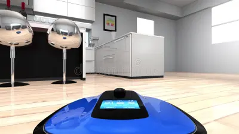

Step 1 - list nouns:

room  - the place where everything is happening. not sure if it actually changes. but maybe can be asked to go to this room. or room doesnt matter, only the location special marker
the robot - walks, sweeps, fights, can change appearence. has the functionality of a standard rpg player character
furniture - something that we can clean or go under. obstacles
pets - someone who live alongside us, can shed fur, can make mess, can interfere with us. like npc that are friendly but unhelpful
people - put obstacles, walk in front of us, turn us off and on, can move us randomly. 
robot base - has inside layer which is robot house where we store what we found, do upgrades, etc.
dirt patch - something that is swept. can have something in it, like microplastic, protein in hair, something else. mostly just dust
animal fur -  - can be collected.

robot has:
- inventory where it collects things from the floor. 
- stats: capacity of inventory, speed of moving, other attributes, skills,
- stats: battery lifetime
- quests: what to do
- possible upgrades like hands that can grab or legs that can go upstairs or a cannon to fight dust bunnies

aesthetics: feeling of discovery and getting reward for it and for doing quests. like crimson desert or the witcher 3. no strict resource management. you just turn off and the human places you back to your place with everything from inventory thrown away

camera perspective: first person view, but slightly back, so we can see parts of our body

control: go forward and back with w, s, rotates with a, d; camera rotates with mouse. not tank control in its purest form, nor the omnidirectional.

cleaning: on interact button, very swift, half a second action with sound of sucking air

For version 1:
- Discrete DirtPatch objects — placed in the scene, each is a GameObject with a state (dirty/clean). Simple, authored, easy to track progress ("3 of 7 cleaned"). when the state is changed to clean, vfx of sparkles is played
- so some patches give us small yellow beads, and when we collect like 3 of them , then we get flashlight. 

future ideas:
upgrade: hidden compartment that human cannot throw away things from
cpecial level: a friend o f a human asks to lend her us (a cleaner) because her mother in law put sparcles everywhere to check how well she cleans her house
to go under dark places there is an upgrade a flashlight
to go under low sofa, we need upgrade slim mode

the cinematic story beginning: a human buys the newest model of robo cleaner in a suspicious underground store. brings it home and sets the auto cleaning when they are at work. but the robot is not a simple one. it has gone haywire, gain consciousness and now we control him

realisation: 
Interaction button belongs to robot, not to dirt
rigidbody belongs to robot too, no character controller, also not for dirt patches