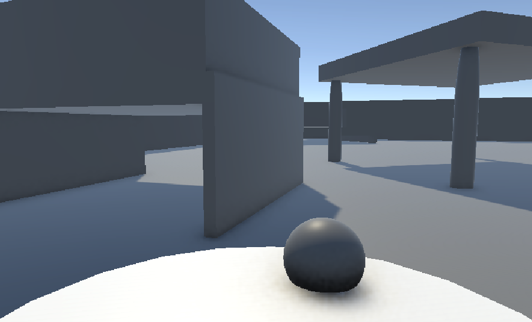

# Prototype Blueprint — Vertical Slice

Reference this when starting Unity work. Do not expand scope beyond what is listed here.

---

## What the prototype must contain (exact scope)

No more, no less.

| Element | Prototype requirement |
|---|---|
| Scene | One room. Placeholder geometry. A floor, walls, one piece of furniture with a gap the robot can't fit through by default. |
| Robot | Movement, clean action, module collection (modeled as a `HashSet<ModuleData>` from day one even with one entry). |
| Dirt | 5–8 discrete DirtPatch objects placed in the scene. Some contain yellow beads. |
| Goal | A hardcoded `GoalManager` that tracks bead count, awards flashlight at 3 beads, awards slim mode at 7 beads. |
| Module gate | One `ObstacleGate` (the low sofa gap) that checks `robot.HasModule(slimModeData)` and opens accordingly. |
| Feedback | Sparkle VFX when a patch is cleaned. Log/signal when module is earned. Sock found under sofa = end state (congratulations popup). |
| Camera | Close third-person, low to floor, slightly behind the robot. Mouse rotates camera. No transitions. |

That's it. No save system. No real UI beyond the end popup. No second room. No inventory screen.

---

## What to predefine architecturally (before writing MonoBehaviours)

### Three ScriptableObjects to define first

**1. `ModuleData` (ScriptableObject)**
```csharp
// Each module is a data asset. Robot owns a collection of these.
// Adding a new module = author a new asset, zero code changes.
[CreateAssetMenu]
public class ModuleData : ScriptableObject
{
    public string moduleId;       // "slim_mode", "flashlight", etc.
    public string displayName;
}
```

**2. `GameEvent` (ScriptableObject) — Ryan Hipple pattern**
```csharp
// A reusable event channel. Raise from anywhere, subscribe from anywhere.
// No direct references needed between systems.
[CreateAssetMenu]
public class GameEvent : ScriptableObject
{
    private readonly List<GameEventListener> _listeners = new();
    public void Raise() { ... }
    public void Register(GameEventListener l) { ... }
    public void Unregister(GameEventListener l) { ... }
}
```

Create two event assets: `OnDirtCleaned.asset` and `OnModuleAcquired.asset`.
Nothing subscribes to them yet — that is fine. They exist because something will.

**3. `RobotConfig` (ScriptableObject)**
```csharp
[CreateAssetMenu]
public class RobotConfig : ScriptableObject
{
    public float moveSpeed = 3f;
    public float cleanRadius = 0.4f;
    public float slimModeHeightMultiplier = 0.4f;
    // All tunable numbers live here, not baked into MonoBehaviours
}
```

---

### Four MonoBehaviours for the slice

- **`RobotController`** — reads `RobotConfig`, handles WASD + mouse camera input, clean action on interact button, owns `HashSet<ModuleData>`. Raises events.
- **`DirtPatch`** — state (dirty / clean). Optional bead payload. Responds to clean trigger. Raises `OnDirtCleaned`.
- **`GoalManager`** — hardcoded. Counts beads collected. Awards flashlight at 3, slim mode at 7. Shows end popup when sock is found. This gets replaced by a real quest system later — the event architecture means that replacement never touches any other script.
- **`ObstacleGate`** — listens for `OnModuleAcquired`. Checks if robot has the required module. Opens the sofa gap (disable collider, play animation).

---

### Folder structure

```
Assets/
  Scripts/
    Core/
      ModuleData.cs
      GameEvent.cs
      GameEventListener.cs
      RobotConfig.cs
    Robot/
      RobotController.cs
    World/
      DirtPatch.cs
      ObstacleGate.cs
    Goals/
      GoalManager.cs
  Data/
    Modules/
      SlimMode.asset
      Flashlight.asset
    Events/
      OnDirtCleaned.asset
      OnModuleAcquired.asset
    Config/
      RobotConfig.asset
  Scenes/
    Prototype.unity
```

---

## Explicitly out of scope for this prototype

Do not implement these, even if tempting:

- Inventory UI / HUD
- Save / load
- Real quest system
- Multiple rooms or room transitions
- Cat / pet AI
- Stats panel
- Art or audio polish

The test: after earning slim mode, does going under the sofa feel like something? If yes, the loop works.

movement:

